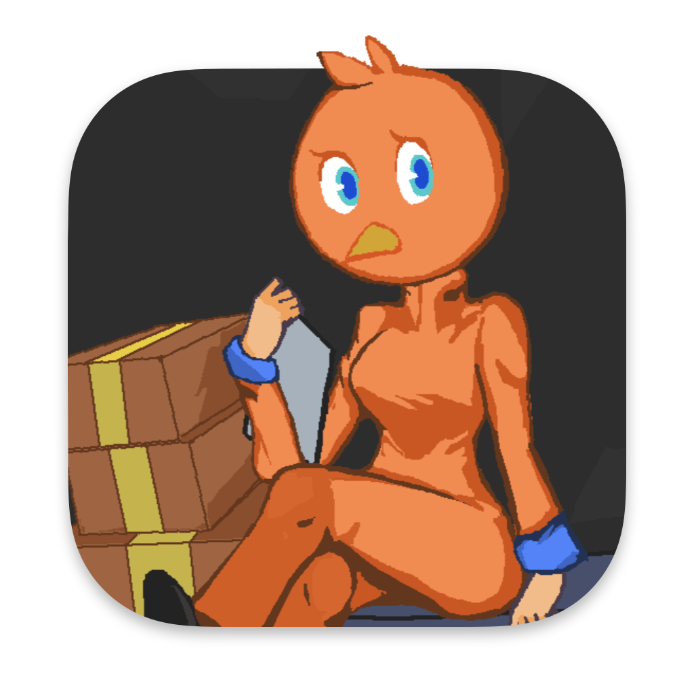

# Package Resolved

It's another day at the Swifty Package Factory, and you have a long list of orders to deliver, with no time to spare! Can you collect all of the packages to deliver in the time allotted? Watch out for palettes and wet floors, or you'll get really injured!

**Package Resolved** is a short game written in Godot for the 132nd Trijam game jam. Development time overall was 4 hours, and the artwork in 3 hours.

[](https://marquiskurt.itch.io/package-resolved) [](https://snapcraft.io/package-resolved) [](https://open-store.io/app/package-resolved.marquiskurt)

## How to play

Use the arrow keys or the A and D keys to move left and right; for touchscreen devices, tap and hold on the left and right edges. Run into packages to collect them, and avoid running into palettes. You must collect all of the required packages (seen in top left) before time runs out (seen top right). You can choose between the regular arcade game with levels, or you can play the endless mode and see how far you can get.

### Powerups

- Packages with a red border act as the equivalent of collecting two packages.
- Pocket watches with the plus sign add time to your timer.

### Hazards

- Water puddles marked with wet floor signs cause you to speed up.
- Palettes marked with wet floor signs cause an instant game over on contact.

## Build from source

### Developer Tools

For this project, you will need the following tools installed:
- Godot 3.3 or better

The following tools are not required to build the game, but are useful for certain variants or other source purposes:

- Xcode 12 or better, for signing certificates
- iconutil, for creating the Mac icon file
- Aseprite, for making the sprite files
- clickable, for making the Ubuntu Touch variant
- snapcraft, for making the Snapcraft variant

### Export the project
Clone the repository code from GitHub via `git clone`, then open the project in Godot. To export the projects, go to **Project > Export**
and then create the export settings for the platforms you want to target.

> Note: You will need to make sure the export configurations also export JSON files in the "Features" tab to ensure the dialogue appears correctly.

### Ubuntu Touch click packages

Start by building the project as you would for standard, x86-64 Linux*. Copy the resulting .pck file from the `dist/linux` directory (or whereever you specified the Linux export) into the `clickable` directory and rename it to `package-resolved.pck`. In the terminal, run the following:

```
$ cd clickable
$ clickable build
```

The resulting click file should be present in the `build` directory inside of `clickable`, which can be installed on an Ubuntu Touch device by copying the file over.

> \*You may also use the "Export PCK/ZIP" option instead of "Export Project", as the binary file(s) is/are not necessary for building the click package. Clickable will download a custom Godot binary.

#### Multiple architectures

Note: To build for different architectures, pass in the `CLICKABLE_ARCH `environment variable.

For example, to build for armhf and arm64:
```
$ CLICKABLE_ARCH=armhf clickable build
$ CLICKABLE_ARCH=arm64 clickable build
```
> Note: It is recommended that you provide packages for at least the `armhf` and `arm64` architectures.

### Snap packages
After exporting the project, create a ZIP file of the exported `linux` directory and name it `package-resolved_linux.zip`. Move the ZIP file to the root of the project and run `snapcraft` to make a snap.

## Credits

- Swift bird costume sprite based off of character template created by LimeZu.
- Main menu artwork created by Raseruuu.
- Music and SFX created with JSFXr and BeepBox.
- Inter font created by Rasmus Andersson.
- JetBrains Mono font created by JetBrains s.r.o.

This project is neither affiliated with nor endorsed by Apple Inc. Swift (programming language) is a trademark of Apple Inc.

